# System Inteligentnego Monitorowania z ESP8266, MQTT oraz Detekcją Obiektów i Mowy

## Opis projektu

Ten projekt to zaawansowany system monitorowania i powiadamiania, który łączy różne technologie do zbierania,
przetwarzania i wyświetlania danych w czasie rzeczywistym. Główne komponenty systemu to:

- **ESP8266**: Mikrokontroler wyposażony w wyświetlacz LCD i czujnik temperatury
- **Speech-to-Text**: Moduł rozpoznawania mowy wykorzystujący model Whisper
- **Object Detection**: System detekcji obiektów w czasie rzeczywistym oparty na YOLOv8
- **MQTT Broker**: Zabezpieczony broker do komunikacji między komponentami
- **Wyświetlacz LCD**: Prezentacja wyników rozpoznawania mowy i detekcji obiektów

## Struktura projektu

````
project/
    ├── models/                     # Modele YOLO
    ├── docker-compose.yml         # Konfiguracja Docker
    ├── Dockerfile                 # Konfiguracja obrazu Docker
    ├── emqxsl-ca.crt             # Certyfikat SSL dla MQTT
    ├── esp8266                    # Kod dla ESP8266
    ├── main.py                    # Główny skrypt Python
    ├── Readme.md                  # Dokumentacja projektu
    ├── requirements.txt           # Zależności Python
    ├── speech_processor.py        # Moduł rozpoznawania mowy
    ├── subscriber.py              # Moduł subskrybenta MQTT
    ├── video_to_text.py          # Moduł detekcji obiektów
    └── yolov8n.pt                # Model YOLO

`````

## Autorzy

- Ivan Buhaienko
- Oleksandr Hoi

## Wymagania systemowe

### Sprzęt:

- ESP8266 NodeMCU
- Wyświetlacz LCD I2C 16x2
- Czujnik temperatury DS18B20
- Kamera internetowa
- Mikrofon

### Oprogramowanie:

- Python 3.9+
- Arduino IDE
- MQTT Broker z obsługą SSL/TLS

## Instalacja i uruchomienie

### 1. Konfiguracja ESP8266

1. Zainstaluj Arduino IDE
2. Zainstaluj wymagane biblioteki:
    - `PubSubClient`
    - `ESP8266WiFi`
    - `WiFiClientSecure`
    - `ArduinoJson`
    - `DallasTemperature`
    - `OneWire`
    - `LiquidCrystal_PCF8574`
3. Wgraj kod z folderu `esp8266`
4. Skonfiguruj parametry WiFi i MQTT

### 2. Konfiguracja środowiska Python

1. Utwórz wirtualne środowisko:

````
bash python -m venv .venv .venv\Scripts\activate # Windows source .venv/bin/activate # Linux/Mac
````

2. Zainstaluj zależności:

````
bash pip install -r requirements.txt
````

### 3. Uruchomienie systemu

1. Podłącz i uruchom ESP8266
2. Uruchom moduły Python:

````
bash python run_both.py
````

### 4. Konfiguracja MQTT

System wykorzystuje broker MQTT `jcddef63.ala.eu-central-1.emqxsl.com` z obsługą SSL/TLS.

## Funkcjonalność

### ESP8266:

- Wyświetlanie tekstu na LCD z obsługą polskich znaków
- Automatyczne przewijanie długich komunikatów
- Monitoring temperatury
- Bezpieczna komunikacja MQTT

### Moduł rozpoznawania mowy:

- Ciągłe nasłuchiwanie i rozpoznawanie mowy
- Obsługa wielu języków
- Przesyłanie rozpoznanego tekstu przez MQTT

### Moduł detekcji obiektów:

- Wykrywanie obiektów w czasie rzeczywistym
- Zliczanie wykrytych obiektów
- Przesyłanie statystyk przez MQTT

## Bezpieczeństwo

- Szyfrowana komunikacja MQTT (SSL/TLS)
- Uwierzytelnianie użytkowników
- Zabezpieczenie danych wrażliwych

## Diagramy

### Ogólna architektura systemu

*Diagram przedstawia ogólną architekturę systemu i połączenia między komponentami.*

### Przepływ danych

*Schemat przepływu danych między poszczególnymi elementami systemu.*

### Komponenty ESP8266

*Struktura komponentów wykorzystywanych w module ESP8266.*

### Struktura oprogramowania

*Diagram przedstawiający organizację oprogramowania w systemie.*
